<!-- 
	_header: "" 
-->

<h1>
A 350
 
leggyakoribb hiba,
 
amit IT toborzók 
 
elkövetnek
</h1>

<footer>
 ern0 - 2023
</footer>

---

## 
 IT recruitment jellemzői: 

- sok keresés

---

## 
 IT recruitment jellemzői: 

- sok keresés

	 
	
 
		https://unsplash.com/@evgenit 
	

---

## 
 IT recruitment jellemzői: 

- sok keresés
- **kevés jelölt**

---

## 
 IT recruitment jellemzői: 

- sok keresés
- **kevés jelölt**

---

## 
 IT recruitment jellemzői: 

- sok keresés
- **kevés jelölt**

---

## 
 IT recruitment jellemzői: 

- sok keresés
- **kevés jelölt**

---

## 
 IT recruitment jellemzői: 

- sok keresés
- **kevés jelölt**

---

## 
 IT recruitment jellemzői: 

- sok keresés
- **kevés jelölt**

---

## 
 IT recruitment jellemzői: 

- sok keresés
- kevés jelölt
- **külföldi távmunka**

---

## 
 IT recruitment jellemzői: 

- sok keresés
- kevés jelölt
- **külföldi távmunka**

	
	
 
		https://unsplash.com/@jinyun
	

---

## 
 IT recruitment jellemzői: 

- sok keresés
- kevés jelölt
- külföldi távmunka
- **epikus bénázás**

---

## 
 IT recruitment jellemzői: 

- sok keresés
- kevés jelölt
- külföldi távmunka
- **epikus bénázás**

	
	
 
		https://unsplash.com/@sammywilliams        
	

---

## Állítsuk meg az   epikus bénázást!
---

## Állítsuk meg az   epikus bénázást!

	

	

---

## Állítsuk meg az   epikus bénázást!

	

	

	
	
 
		https://unsplash.com/@jinyun
	

---

## #ÉlményHR

<blockquote>
„A jelöltélmény fogalma egyre gyorsabban terjed a HR-ben. A legtöbb cégnél már 	felismerték, hogy igenis fontos, mit éreznek, mit gondolnak a jelöltek.”
</blockquote>

---

## #ÉlményHR

<blockquote style="opacity: 50%">
„A jelöltélmény fogalma egyre gyorsabban terjed a HR-ben. A legtöbb cégnél már 	felismerték, hogy igenis fontos, mit éreznek, mit gondolnak a jelöltek.”
</blockquote>

---

## #ÉlményHR - P.E.R.M.A.

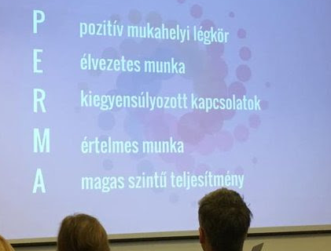

---

## #ÉlményHR - Benefits

---

## #ÉlményHR - Benefits

<blockquote>
„Korszerű lapotopokkal és   iPhone-okkal dolgozunk, melyeket akár magán célra is használhatunk”
</blockquote>

---

## #ÉlményHR - Benefits

<blockquote>
„Korszerű lapotopokkal és   iPhone-okkal dolgozunk, melyeket akár magán célra is használhatunk”
</blockquote>

Nem akkora előny, amit érdemes lenne kiemelni

---

## #ÉlményHR - Benefits

---

## #ÉlményHR - Benefits

<blockquote>
„Kéthetente a [cég] saját rádióadása ébreszt minket”
</blockquote>

---

## #ÉlményHR - Benefits

<blockquote>
„Kéthetente a [cég] saját rádióadása ébreszt minket”
</blockquote>

<blockquote>
„Elérhetőek kedvezményesen igénybe vehető szolgáltatások (masszőr, cipész, szabó, tisztító)”
</blockquote>

---

## #ÉlményHR - Benefits

<blockquote>
„Kéthetente a [cég] saját rádióadása ébreszt minket”
</blockquote>

<blockquote>
„Elérhetőek kedvezményesen igénybe vehető szolgáltatások (masszőr, cipész, szabó, tisztító)”
</blockquote>

<blockquote>
„Péntek esténként a cég jóvoltából fröccsel üdvözölhetjük a hétvégét”
</blockquote>

---

## #ÉlményHR - Benefits

<blockquote>
„Kéthetente a [cég] saját rádióadása ébreszt minket”
</blockquote>

Inkább ne!

---

## #ÉlményHR - Benefits

<blockquote>
„Elérhetőek kedvezményesen igénybe vehető szolgáltatások (masszőr, cipész, szabó, tisztító)”
</blockquote>

Léteznek direkt
ezekre a szolgáltatásokra szakosodott 
cégek, vállalkozók

---

## #ÉlményHR - Benefits

<blockquote>
„Péntek esténként a cég jóvoltából fröccsel üdvözölhetjük a hétvégét”
</blockquote>

A péntek esti program megeszervezését
bízzuk a dolgozókra!

---

## #ÉlményHR - Benefits

---

## #ÉlményHR - Benefits

<blockquote>
„Teljes munkaidő: heti 40 óra; rugalmas munkaidő-beosztás”
</blockquote>

---

## #ÉlményHR - Benefits

<blockquote>
„Teljes munkaidő: heti 40 óra; rugalmas munkaidő-beosztás”
</blockquote>

<blockquote>
„Határozatlan idejű jogviszony”
</blockquote>

---

## #ÉlményHR - Benefits

<blockquote>
„Teljes munkaidő: heti 40 óra; rugalmas munkaidő-beosztás”
</blockquote>

<blockquote>
„Határozatlan idejű jogviszony”
</blockquote>

Kötelező, általános, nincs információtartalma,   
kisbetűs lábjegyzet  

---

## #ÉlményHR - Benefits

---

## #ÉlményHR - Benefits

<blockquote>
„Havi rendszerességgel céges gyümölcsnap.”
</blockquote>

---

## #ÉlményHR - Benefits

<blockquote>
„Havi rendszerességgel céges gyümölcsnap.”
</blockquote>

<blockquote>
„Csocsóasztal”
</blockquote>

---

## #ÉlményHR - Benefits

<blockquote>
„Havi rendszerességgel céges gyümölcsnap.”
</blockquote>

<blockquote>
„Csocsóasztal”
</blockquote>

<blockquote>
„Edzőtermi támogatás”
</blockquote>

---

## #ÉlményHR - Benefits

„Fun day”, pizza, babzsák, függőágy, Playstation, XBox, csocsó, gyümölcsnap, jóga, kondi, süti, ropi, tánc, spangli

---

## #ÉlményHR - Benefits

„Fun day”, pizza, babzsák, függőágy, Playstation, XBox, csocsó, gyümölcsnap, jóga, kondi, süti, ropi, tánc, spangli

&nbsp;

 #cselédrevü 

---

## #ÉlményHR - Benefits

---

## #ÉlményHR - Benefits

<blockquote>
- work-life balance, rugalmas munkaidó  
&nbsp;&nbsp; heti 40 órában
</blockquote>

---

## #ÉlményHR - Benefits

<blockquote>
- work-life balance, rugalmas munkaidó  
&nbsp;&nbsp; heti 40 órában
</blockquote>

<blockquote>
	- céges laptop, céges mobil
</blockquote>

---

## #ÉlményHR - Benefits

<blockquote>
- work-life balance, rugalmas munkaidó  
&nbsp;&nbsp; heti 40 órában
</blockquote>

<blockquote>
	- céges laptop, céges mobil
</blockquote>

<blockquote>
	- cafetéria
</blockquote>

---

## #ÉlményHR - Benefits

<blockquote>
	- work-life balance, rugalmas munkaidó  
&nbsp;&nbsp; heti 40 órában
</blockquote>

<blockquote>
	- céges laptop, céges mobil
</blockquote>

<blockquote>
	- cafetéria
</blockquote>

<blockquote>
	- 20 fős tesztelői csapat, amit te
		menedzselsz
</blockquote>

---

## #ÉlményHR - Benefits

<blockquote>
	- 20 fős tesztelői csapat, amit te
		menedzselsz
</blockquote>

---

## #ÉlményHR - Benefits

<blockquote>
	- 20 fős tesztelői csapat, amit te
		menedzselsz
</blockquote>

 Látom ám, hogy mi folyik itt!

 

---

## #ÉlményHR - Benefits

---

## #ÉlményHR - Benefits

<blockquote>
„Nagyon érdekes, Győrben egyedülálló, ritka pozíció." (SAP szakértő)
</blockquote>

---

## #ÉlményHR - Benefits

	

---

## #ÉlményHR - Benefits

<blockquote>
„Nagyon érdekes, Győrben egyedülálló, ritka pozíció." (SAP szakértő)
</blockquote>

(Győr nagyon szép város)

---

## #ÉlményHR - Benefits

<blockquote>
„Nagyon érdekes, Győrben egyedülálló, ritka pozíció." (SAP szakértő)
</blockquote>

A munkahelyek regionális megítélésének vonzereje nem túl magas

---

## #ÉlményHR - Határidő

---

## #ÉlményHR - Határidő

	

---

## #ÉlményHR - Határidő

	

Biztosítsunk 2-3 hetes időablakot 
a jelentkezésre!

---

## #ÉlményHR - Határidő

	

Biztosítsunk 2-3 hetes időablakot 
a jelentkezésre!

  

Sürgős esetben is adjunk 
3-5 napot, és
emeljük ki a rövid jelentkezési
határidőt!

---

## Munkaköri leírás

---

## Munkaköri leírás

	

---

## Munkaköri leírás

---

## Munkaköri leírás

	&nbsp;

	&nbsp;REMÉNY-

---

## Munkaköri leírás

	&nbsp;

	&nbsp;REMÉNY-
	 
	&nbsp;TELEN

---

## Munkaköri leírás

	&nbsp;

	&nbsp;REMÉNY-
	 
	&nbsp;TELEN.

---

## Munkaköri leírás

	&nbsp;

	&nbsp;REMÉNY-
	&nbsp; 
	&nbsp;TELEN.

	
	
 
		https://unsplash.com/@dentrushtin	
	

---

## Munkaköri leírás

---

## Munkaköri leírás

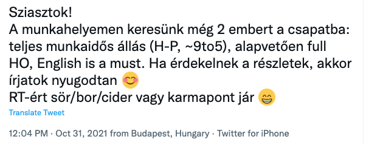

---

## Munkaköri leírás

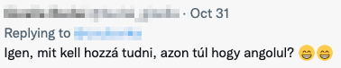

---

## Munkaköri leírás

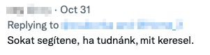

---

## Munkaköri leírás

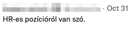

---

## Munkaköri leírás

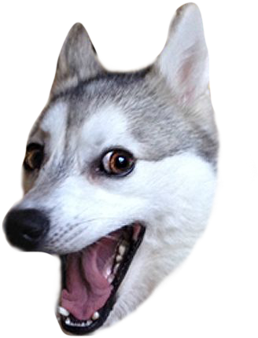

---

## Munkaköri leírás

Törekedjünk a munkakör minél pontosabb leírására!

---

## Munkaköri leírás

---

## Munkaköri leírás

<blockquote>
"I am looking for software programmers"
</blockquote>

---

## Munkaköri leírás

<blockquote>
"I am looking for software programmers"
</blockquote>

 

Minél pontosabban fogalmazzuk meg a
munkaköri feladatokat!

---

## Munkaköri leírás

<blockquote>
"I am looking for software programmers"
</blockquote>

 

Minél pontosabban fogalmazzuk meg a
munkaköri feladatokat!

  

Soroljuk fel a használt technológiákat,
akár csak kulcsszavakban!

---

## Munkaköri leírás

---

## Munkaköri leírás

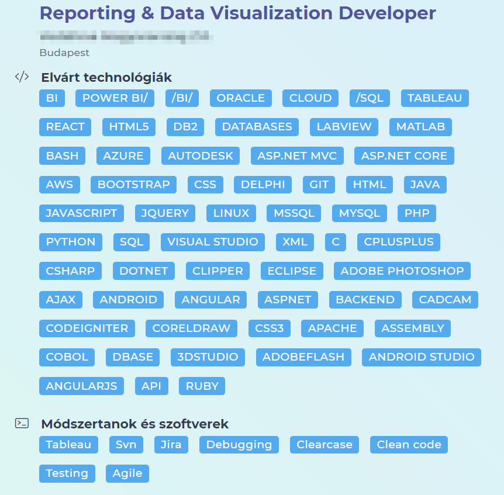

---

## Munkaköri leírás

---

## Munkaköri leírás

---

## Munkaköri leírás

SZOFTVER FEJLESZTŐI
 
POZI NEM ÉRDEKEL?

	Clipper, Adobe Flash, 3D Studio, Assembly, Delphi, 
	MatLab, Angular, Photoshop, SQL, JQuery, 
	CAD-CAM, Android, C#, API, Java, dBase, Cobol?

---

## Munkaköri leírás

&nbsp;
&nbsp;

Biztos csak véletlen...

---

## Munkaköri leírás

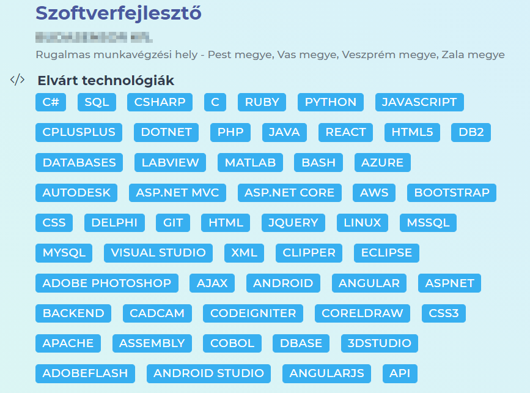

---

## Munkaköri leírás

---

## Munkaköri leírás

&nbsp;

Csak a mindenképpen szükséges
technológiákat soroljuk fel!

---

## Munkaköri leírás

---

## Munkaköri leírás

<blockquote>
"Can read, understand and maintain 
existing code (and learn from it)"
</blockquote>

---

## Munkaköri leírás

<blockquote>
"Can read, understand and maintain 
existing code (and learn from it)"
</blockquote>

Tisztességes dolog megemlíteni,
hogy legacy kódban kell turkálni,
de ne adjuk el tanulási lehetőségként!

---

## Munkatapasztalat

---

## Munkatapasztalat

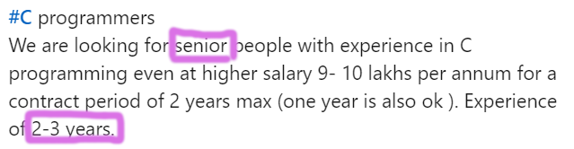

---

## Munkatapasztalat

2-3 év munkatapasztalat:
nem senior, hanem junior

---

## Munkatapasztalat

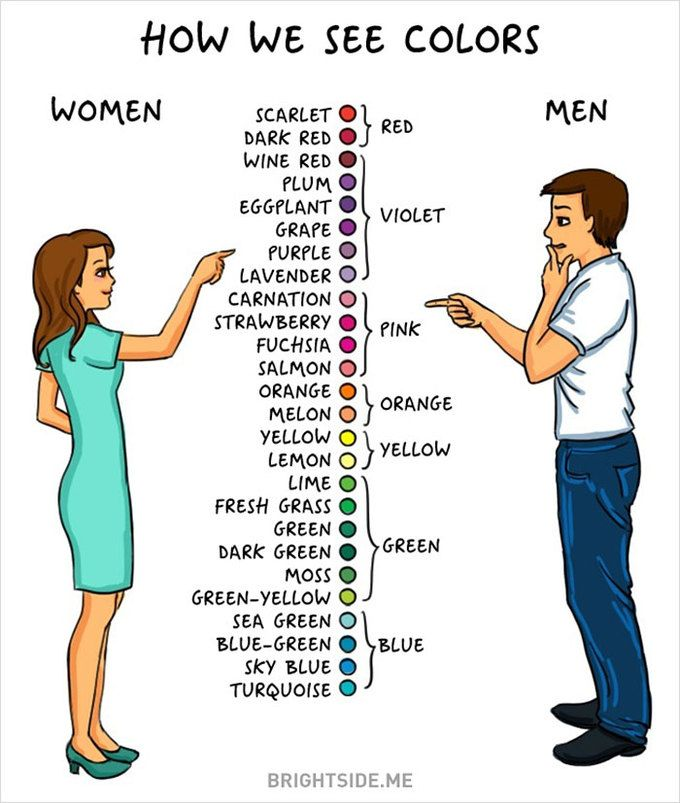

---

## Munkatapasztalat

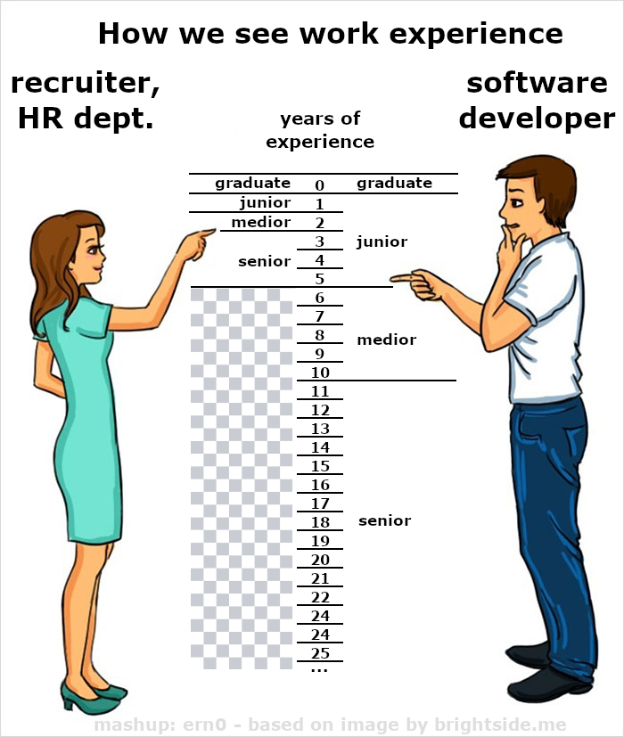

---

## Munkatapasztalat

Bár az már igaz, hogy a senioritás 
nem a munkában eltöltött éveket jelenti, 
kezeljük lazábban az éveket

---

## Munkatapasztalat

Bár az már igaz, hogy a senioritás 
nem a munkában eltöltött éveket jelenti, 
kezeljük lazábban az éveket

  

Bízzuk a szakmai vezetőre, 
hogy megállapítsa, 
ki az alkalmas jelölt

---

## Kreatív toborzás

---

## Kreatív toborzás

	&nbsp; LYALY!

---

## Kreatív toborzás

---

## Kreatív toborzás

	

---

## Kreatív toborzás

	

	Ne legyünk igénytelenek

---

## Kreatív toborzás

---

## Kreatív toborzás

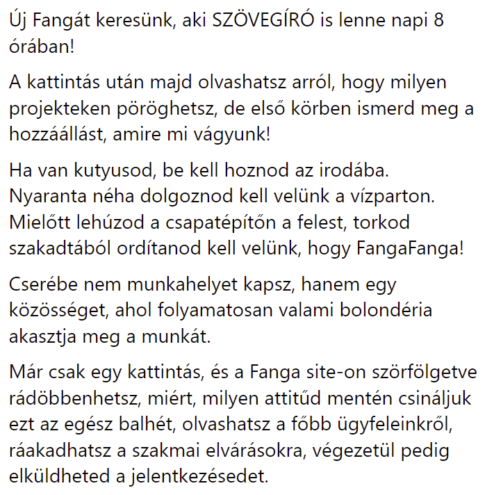

---

## Kreatív toborzás

---

## Kreatív toborzás

---

## Kreatív toborzás

---

## Kreatív toborzás

  

	Hahó! A gólyatábor véget ért!

---

## Kreatív toborzás

---

## Kreatív toborzás

<blockquote>
Kedves Csaba,
  
Ha jól látom Te is a front end világában mozogsz és úgy sejtem megkeresésekből sincs hiány. 
  
No de elgondolkodtál e már azon, hogy az álláskeresési szempontjaidat tekintve melyik Gyűrűk Ura szereplő lennél?
</blockquote>

---

## Kreatív toborzás

<blockquote>
Kedves Csaba,
  
Ha jól látom Te is a front end világában mozogsz és úgy sejtem megkeresésekből sincs hiány. 
  
No de &nbsp;elgondolkodtál e&nbsp; már azon, hogy az álláskeresési szempontjaidat tekintve melyik Gyűrűk Ura szereplő lennél?
</blockquote>

	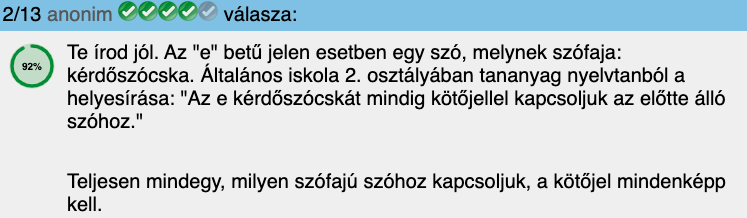

---

## Kreatív toborzás

<blockquote>
Nos, az a jó hírem, hogy nálam nem 1️, de 8 Frontend Developer lehetőség is van és annak megkönnyítése érdekében, hogy melyik lehet Számodra leginkább érdekes, összeállítottam egy 2 perces kvízt, ami segít ezt eldönteni és közben az is kiderül vajon melyik Gyűrűk Ura szereplő lehetnél Te.
</blockquote>

---

## Kreatív toborzás

<blockquote>
Ide kattintva találod a kvízt:  https://XXXXX/lord-of-the-frontends
  
Kíváncsian várom az eredményed és ha szeretnél többet tudni a lehetőségről/lehetőségekről akkor, ne habozz, írj nekem! ;)
  
Üdv,
Sára
</blockquote>

---

## Kreatív toborzás

	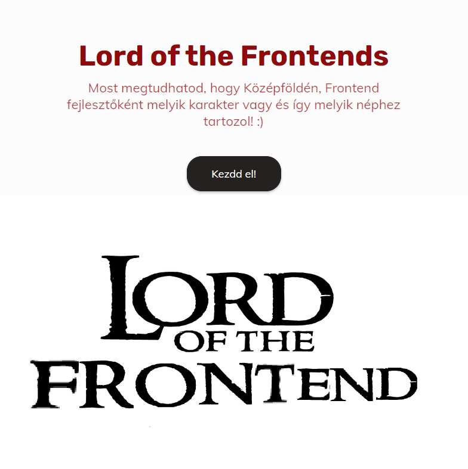

---

## Kreatív toborzás

	

	Kontraproduktív: 
	a ninják nem jelentkeznek majd,
	csak trollok és orkok

---

## Kreatív toborzás

	

	Kontraproduktív: 
	a ninják nem jelentkeznek majd,
	csak trollok és orkok

	A „Mi az indián neved”
	szintű műfajokat hagyjuk meg 
	a Facebook népének!

---

## Kreatív toborzás

---

## Kreatív toborzás

<blockquote style="font-size: 48pt;">
REACTES FARKASRA VADÁSZUNK!
  
Farkasfalkánk új frontendes tagját keressük, hosszútávú otthoni remote munkavégzésre.
  
Fontos, hogy legalább medior szinten legyen a tudásod, légy maximalista, energikus.
  
Ha felkeltettük érdeklődésed, csatlakozz a falkához! karrier@xxxxxx.com
</blockquote>

---

	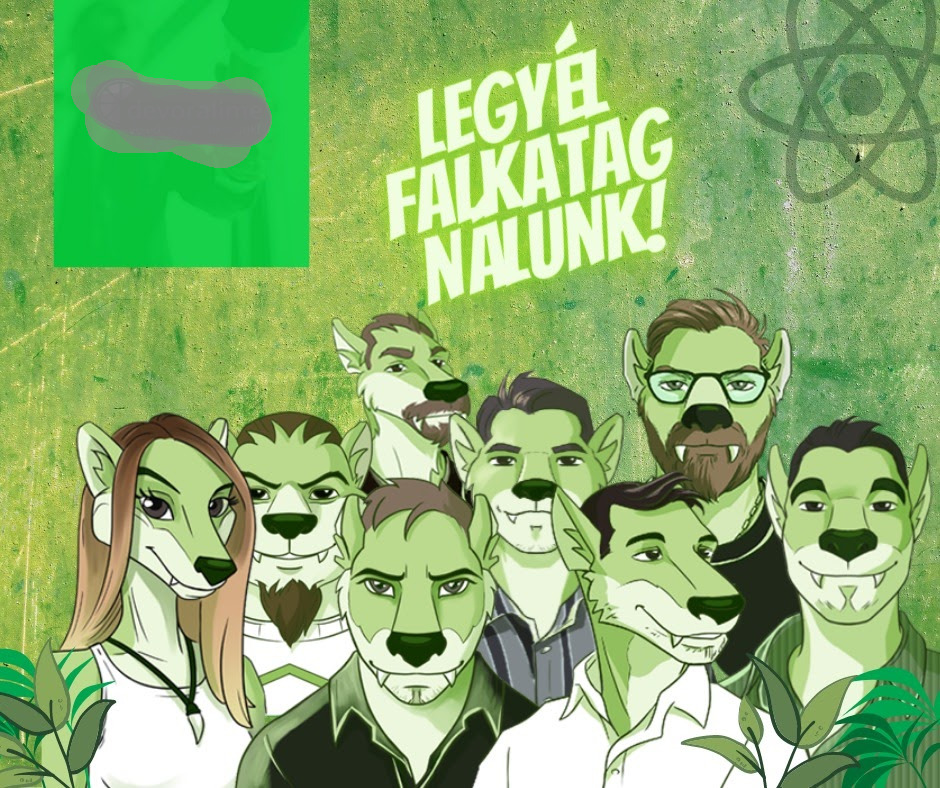

---

	

	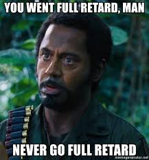

---

	

	

---

	

	

---

