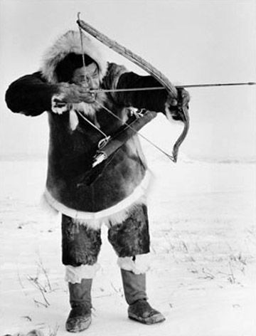

<!-- _header: "" -->

<h1>
A 350
 
leggyakoribb hiba,
 
amit IT toborzók 
 
elkövetnek
</h1>

<footer>
 ern0 - 2023
</footer>

---

## IT recruitment jellemzői:
- sok keresés

---

## IT recruitment jellemzői:
- sok keresés

	 
	
 
		https://unsplash.com/@evgenit 
	

---

## IT recruitment jellemzői:
- sok keresés
- **kevés jelölt**

---

## IT recruitment jellemzői:
- sok keresés
- **kevés jelölt**

---

## IT recruitment jellemzői:
- sok keresés
- **kevés jelölt**

---

## IT recruitment jellemzői:
- sok keresés
- **kevés jelölt**

---

## IT recruitment jellemzői:
- sok keresés
- **kevés jelölt**

---

## IT recruitment jellemzői:
- sok keresés
- **kevés jelölt**

---

## IT recruitment jellemzői:
- sok keresés
- kevés jelölt
- **külföldi távmunka**

---

## IT recruitment jellemzői:
- sok keresés
- kevés jelölt
- **külföldi távmunka**

	
	
 
		https://unsplash.com/@jinyun
	

---

## IT recruitment jellemzői:
- sok keresés
- kevés jelölt
- külföldi távmunka
- **epikus bénázás**

---

## IT recruitment jellemzői:
- sok keresés
- kevés jelölt
- külföldi távmunka
- **epikus bénázás**

	
	
 
		https://unsplash.com/@sammywilliams        
	

---

## 
 Állítsuk meg az   epikus bénázást! 

---

## 
 Állítsuk meg az   epikus bénázást! 

	

	

---
## 
 Állítsuk meg az   epikus bénázást! 

	

	

	
	
 
		https://unsplash.com/@jinyun
	

---
