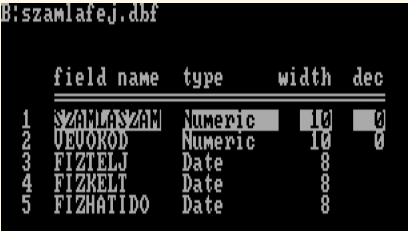
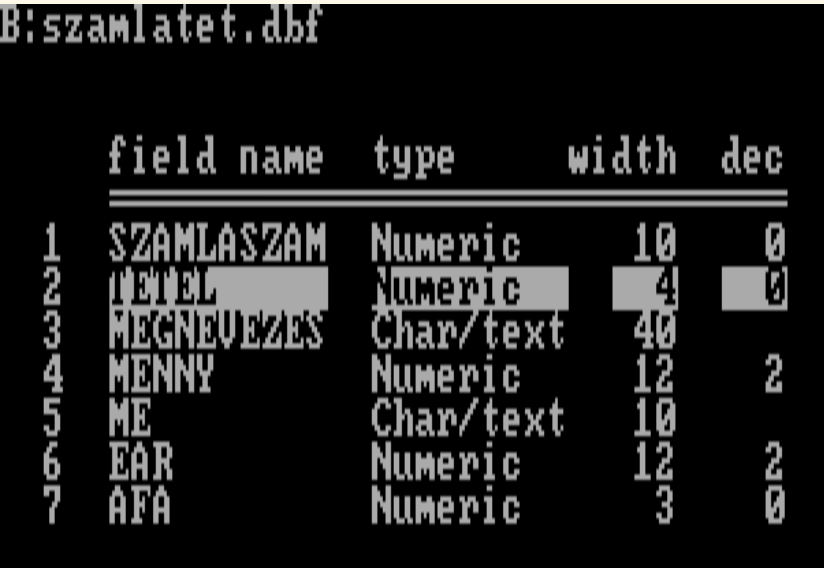

# Adatbáziskezelés a '70-es években: MUMPS

*2025.11.17 - DRAFT*

## Bevezető

\- *A 256-byte intróidhoz milyen framework-öt használsz?
Vagy csak simán OpenGL-t?* - kérdezte tőlem egyszer egy
fiatal kolléga.
Elmagyaráztam neki,
hogy 256 byte-ba
kb. már az OpenGL kép megnyitása se férne bele,
ezért direktben rakosgatjuk a pixeleket a VGA vidómemóriába,
ráadásul MS-DOS alatt,
mivel
egyrészt
a `.COM` formátumnak nincs fejléce,
így mind a 256 byte-ot nettó kódra lehet elkölteni,
másrészt
a 16-bites 8086/80286 utasítások jóval rövidebbek
mint a 32 vagy 64 bitesek,
továbbá a BIOS és a DOS hívások is tömörek.

A **MUMPS** rendszerek
is hasonlóan nehezen befogadhatóak mai ésszel.
Megalkotásakor,
*1966-ban*
a tervezőknek
olyan korlátokat kellett leküzdeni,
amiket ma már igazából meg sem értünk,
nemhogy felmerülnének.
Ezért a rendszer
elemeit, funkcióit, az egyes megoldásokat
mindig ennek a tükrében kell értékelni.

> Ebben az írásban ezt az egyszerűséget,
puritánságot szeretém bemutatni,
átadni azt az érzést,
amikor egy rendszert - annak egyszerűsége miatt -
teljesen átlátunk.

## A nyelv

### Interpteter

A MUMPS **interpretált** nyelv.
Az interpreter egy program,
ami az adott nyelven írt programot
beolvassa és utasításról utasításra végrehajtja.

Ez lassabb, mint amikor a programszöveget (forráskódot)
egy *compiler* lefordítja gépi kódra,
és az így kapott programot
közvetlenül futtatjuk a gépen,
viszont maga a fordítás erőforrás- és időigényes.
A MUMPS esetében,
ahol a programok többsége adatbázist kezelő alkalmazás,
ez nem gyorsítana sokat,
mivel
az idő nagy részét
nem a program által végzett
számolások és logikai döntések viszik el,
hanem az adatbázis-műveletek.

> A modern MUMPS-ok már többnyire
JIT compilert használnak:
a program futása előtt
a forráskód automatikusan lefordul gépi kódra.

### Tokenizálás helyett

Az interpretált nyelvek esetén
nem az utasítások, hanem tokenjeik kerülnek tárolásra.
Például ha van egy Commodore BASIC programunk:
```
10 PRINT "HELLO"
```
a memóriában nem az lesz,
hogy "PRINT" (5 byte),
hanem a `PRINT` utasítás tokenje: `153` (`$99`),
ami csak 1 byte.
A Commodore BASIC a program írásakor
kikeresi a kulcsszavakhoz való tokeneket,
és azt tárolja el a programsorban,
amivel azt nyerjük,
hogy
futás közben nem kell már kulcsszavakat keresgélni,
csak az 1 byte-os tokeneket kell interpretálni.
Még annyi teendő van a tokenekkel, hogy
listázáskor a token kódok helyett
utasítások neveit kell kiírni.

A MUMPS nem tokenizál,
mégis csak 1 byte-os utasításokat interpretál.
A trükk egyszerű:
minden utasítás különböző betűvel kezdődik,
így az első betű maga a token,
a többit ki sem kell írni
(nem is javasolt, mert csak a helyet foglalja).

```
FIZZBUZZ ; FizzBuzz in MUMPS, using short instructions
         ;
         S I=0
NEXT     S I=I+1
         ;
         I I#15=0 W "FizzBuzz",! G NEXT
         I I#3=0 W "Fizz",! G NEXT
         I I#5=0 W "Buzz",! G NEXT
         W I,!
         ;
         I I<100 G NEXT
         Q
```

Az egybetűs utasításokat meglepően könnyű megszokni,
én egyszer kaptam egy kis feladatot,
20-soros programot kellett írnom,
viccből teljes utasításokkal írtam meg.
Mögém állt a fél Számítástechnikai osztály,
ilyet még nemigen láttak,
aztán a Józsi, a vezető programozó megszólalt:

\- *Ez nagyon szép, de mégegyszer ne csinálj ilyet,
nagyon zavaró.*

```
FIZZBUZZ ; FizzBuzz in MUMPS, using full instructions
         ;
         SET I=0
NEXT     SET I=I+1
         IF I#15=0 WRITE "FizzBuzz",! GOTO NEXT
         IF I#3=0 WRITE "Fizz",! GOTO NEXT
         IF I#5=0 WRITE "Buzz",! GOTO NEXT
         WRITE I,!
         ;
         IF I<100 GOTO NEXT
         QUIT
```

> A modern MUMPS-ok esetében javasolt
a teljes utasításnevek kiírása, és
a GOTO utasítás minél kevesebb használata.

### Operátor precedencia

Egyszer egy órácskát eljátszottam egy egyszerű képlettel,
sehogy sem jött ki az az eredmény, amire vágytam.
Nagyjából így nézett ki:
```
> SET A=2,B=3
> WRITE A*10+B*5
115                ; 35 helyett
```

Karcsi, a szervezési osztály vezetője mögém állt,
nézte, mit szenvedek:

\- *Tegyél zárójeleket!*

```
> SET A=2,B=3
> WRITE A*10+(B*5)
35
```

Ez is csak az optimalizálás végett van így:
a kiértékelés operátor-precedencia nélkül
gyorsabb,
kevesebb memória kell hozzá, és
valamivel kisebb az interpreter programja is.

## Az adatbázis

### Tábla helyett fa-struktúra

A kor kedvenc adatbázis-kezelője
a *dBaseIII* volt PC-re,
valamint az ezzel kompatibilis rendszerek:
*FoxPro*, *Clipper*.

Ezek tábla alapú rendszerek,
kb. mint az SQL (csak kurzorral).

Ha például számlákat akartunk nyilvántartani,
akkor egy ehhez hasonló adatbázist kreáltunk:

- számla adatai: 
- tételek: 

MUMPS-ban nincsenek sémák. Ha egy változó neve
`^` (caret) jellel kezdődik,
MUMPS-os terminológiában *global*-nak nevezzük,
ami azt jelenti,
hogy az értéke egyből disk-en tárolódik,
és más felhasználók is elérhetik.

Pl. az egyik felhasználó létrehoz egy `^ANSWER`
nevű globalt:
```
> SET ^ANSWER=42
```
Egy másik felhasználó azonnal láthatja az értékét:
```
> WRITE ^ANSWER,!
42
```

Minden változónak, az értékén felül
lehetnek child node-jai, számla esetén:
- számla-1
  - tétel1
  - tétel2
- számla-2
  - tétel1
  - tétel2
  - tétel3

A mezőket pedig egyszerűen egy értékként tároljuk,
elválasztójelekkel,
a rendszerprogramok `^` (caret),
a felhasználói programok `|` jelet
használnak erre általában.

További magyarázkodás helyett lássunk egy
példát, hozzunk létre egy számlát:

```
S ^SZAMLA(14)="83992|2025.01.01|2025.01.03|2025.02.03"
```
Ez volna a `14`-es számla feje, a `83992` vevő részére.
```
S ^SZAMLA(14,1)="labda|5|db|800|27"
S ^SZAMLA(14,2)="síp|1|db|500|27"
```
Ezek pedig a tételek, öt labda és egy síp.

Természetesen az értékadáskor *autovivification* van,
egy tetszőleges mélységben lévő node létrehozható
anélkül, hogy a felsőbbek léteznének.

### Mezők helyett elválasztójel

Ha ki akarunk venni egy adatot a fenti adatbázisból,
akkor azt így tehetjük meg:
```
> W "Sipok száma: ", $P(^SZAMLA(14,2),"|",2),!
1
```
Az elválasztójelek közüli kivételhez a `$PIECE()`
függvény használható.

Érdekesség: a későbbi verziójú MUMPS-okban
ez a függvény
szerepelhet a kifejezés bal oldalán is:

```
> S $P(^SZAMLA(14,1),"|",2)=6
```

Ha nincsenek fix hosszúságú mezők,
akkor az adatok csak annyi helyet foglalnak,
amennyi a tényleges hosszuk.

> A számla tétel példánkban - az indexeken felül -
az adatok minden rekord esetén
40 + 12 + 10 + 12 + 3 = 77 byte-ot igényelne
15 és 17 helyett.

Az opcionális, ritkán használt mezők
költsége alacsony,
mert ha nincs kitöltve,
akkor csak az elválasztójelet kell tárolni.

Természetesen van hátránya is ennek a tárolási módnak,
például ránézésre nem lehet tudni,
milyen adatot tárol a tábla,
és a program sem név szerint hivatkozik a mezőkre.

---

Majd még folytatom.
